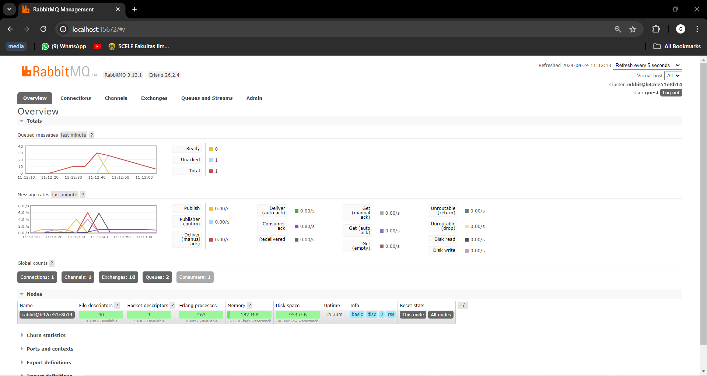

# TUTORIAL 8 ADPRO
#### Rafi Ghani Harditama (2206081364)
#### ADPRO A / VRO

---

## REFLECTION 

1. what is amqp?

AMQP(Advanced Message Queuing Protocol) adalah sebuah  protokol standar dalam lapisan aplikasi untuk middleware yang berorientasi pada pesan. AMQP dirancang untuk mendukung pertukaran data antara aplikasi atau sistem yang terpisah sehingga dapat digunakan untuk melakukan pengiriman dan penerimaan pesan secara andal dan efisien.

2. what it means? guest:guest@localhost:5672 , what is the first quest, and what is the second guest, and what is localhost:5672 is for? 

`guest:guest@localhost:5672` adalah cara untuk menentukan kredensial(username dan password) untuk menghubungkan ke server AMQP yang berjalan di local pada port 5672.

* `guest:guest`: bagian ini merepresentasikan kredensial(`guest` pertama merujuk ke username dan `guest`merujuk ke password) yang digunakan untuk autentikasi.
* `@localhost:5672`: merujuk pada alamat hostname dan port number dari server dimana merupakan tempat broker AMQP berjalan. `localhost` mengacu pada mesin lokal dan `5672` adalah nomor port default untuk komunikasi AMQP. 

# Slow Subscriber

Dapat dilihat dari screenshot diatas, terdapat 30 queued message. Hal tersebut terjadi karena saya menjalankan `cargo run` sebanyak 6 kali. Pada `cargo run` pertama, message masih dapat diproses secara langsung, tetapi 5 sisanya harus masuk ke queue karena terdapat `thread::sleep(ten_millis);` yang membuat penumpukan pesan dalam antrian sebelum diproses lebih lanjut. 